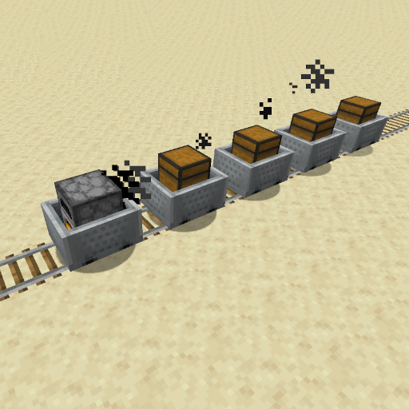
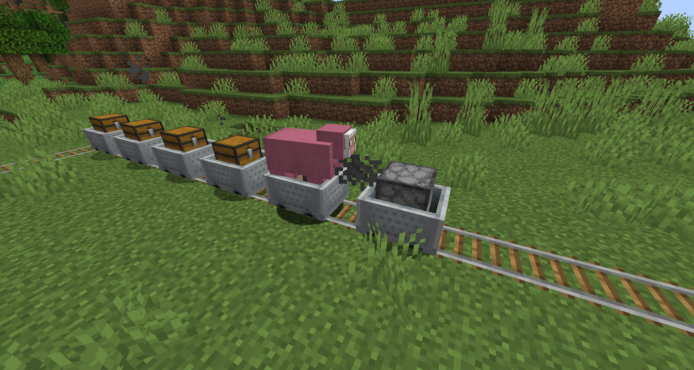

[](https://www.spigotmc.org/)
[]()
[]()
[]()
[](https://github.com/Fridtjof-DE/MinecartTrains/issues)
[](https://discord.gg/fT6VJurHCT)

[](https://modrinth.com/plugin/minecart-trains/versions)

[](https://bstats.org/plugin/bukkit/Minecart%20Trains/18918)
[](https://bstats.org/plugin/bukkit/Minecart%20Trains/18918)

#  Minecart Trains

Introducing Minecart Trains! Experience a whole new level of immersion as you connect minecarts together, transforming them into powerful and efficient trains.


### Features:
- linking minecarts to form a train
- freezing furnace minecarts with non-powered booster rails (to stop trains)
- minecarts at high velocity kill mobs on the track (configurable)
- arrows can't destroy minecarts (configurable)
- coal carts which the furnace cart will refuel from
- fuel consumption of the furnace minecart is configurable
- hsrails compatibility (only on adapted railways)

### How it works:
**Coupling:**

The standard coupling tool is the chain. With this you click on two minecarts one after the other. The second one will follow the first one. With a train you work your way through from front to back. (I am working on making the order irrelevant).

**Coal Carts:**

Furnace minecarts will, if already going, refuel from a coal cart nearby. Coal carts can be crafting with a minecart and a coal block. Coal carts will only interact with hoppers to refill but only coal and charcoal.

### What is planned:
- safe chunk unloading
- auto. chunk loading
- making the linking order irrelevant
- some kind of fuel gauge

### What is not (yet) possible:
- trains that push backwards (w.i.p.)
- trains going around 2x2 curves

### Dependencies

 - PuddingAPI ([plugin jar](https://modrinth.com/plugin/puddingapi)) ([source](https://github.com/Fridtjof-DE/PuddingAPI))

### Relevant Links

 - modrinth: https://modrinth.com/plugin/minecart-trains
 - bStats: https://bstats.org/plugin/bukkit/Minecart%20Trains/18918

## How to Build

If you are looking to make changes, then you'll need to get both a JDK 17 and Maven installed on your computer. I recommend just using an IDE like Intellij IDEA or Eclipse.

### Building Pudding API

If only want to make changes to `main-branch` of MinecartTrains you can just download the latest ([PuddingAPI jar](https://modrinth.com/plugin/puddingapi)) from Modrith.

If you want to make changes to a `dev-branch` of MinecartTrains you might need to download the latest ([PuddingAPI dev-build](https://github.com/Fridtjof-DE/PuddingAPI/tree/master/builds)) from GitHub.

If you also want to make changes to the PuddingAPI you'll need to have the [PuddingAPI](https://github.com/Fridtjof-DE/PuddingAPI) source installed. On more information on how to build PuddingAPI look at it's GitHub.

Either way PuddingAPI has to be in the correct sister folder specified in the MinecartTrains `pom.xml`.

### Building Minecart Trains

Once you have Pudding API built and the jar generated, update the
`puddingapi.jar` property in the `pom.xml` file of the current 
project, to ensure it points to the jar generated in the 'Building
PuddingAPI' section.

Once the `pom.xml` file has been updated, you can kick off the build:

```
mvn package
```

Results will be in the `target` folder, with base name
`MinecartTrains`. Assuming the current marked release is 2.0.0
(see version value in pom.xml), you'll have the following file:

  - `MinecartTrains-2.0.0.jar`

Copy this file over to the plugins folder of your Minecraft server. Also, don't forget to have copied the PuddingAPI jar as well, to your
server's plugins folder.

## bStats

