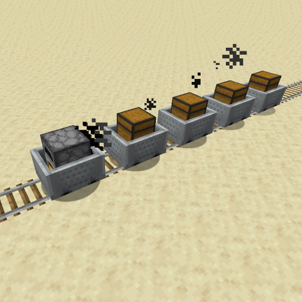

[](https://www.spigotmc.org/)
[]()
[](https://github.com/Fridtjof-DE/MinecartTrains/issues)
[](https://discord.gg/fT6VJurHCT)

[](https://modrinth.com/plugin/minecart-trains/versions)

[](https://bstats.org/plugin/bukkit/Minecart%20Trains/18918)
[](https://bstats.org/plugin/bukkit/Minecart%20Trains/18918)

#  Minecart Trains

Introducing Minecart Trains! Experience a whole new level of immersion as you connect minecarts together, transforming them into powerful and efficient trains.


### Features:
 - linking minecarts to form a train
 - freezing furnace minecarts with non-powered booster rails (to stop trains)
 - minecarts at high velocity kill mobs on the track
configuration file

### How it works:
The standard coupling tool is the chain. With this you click on two minecarts one after the other. The second one will follow the first one. With a train you work your way through from front to back. (I am working on making the order irrelevant).
 
### What is planned:
 - an inventory for furnace minecarts, from which they can be filled automatically
 - chunk loading

### What is not (yet) possible:
 - trains that push backwards (w.i.p.)
 - trains going around 2x2 curves

### Dependencies

 - Pudding API ([source](https://github.com/Fridtjof-DE/PuddingAPI)) ([plugin jar](https://modrinth.com/plugin/puddingapi))

### Relevant Links

 - modrinth: https://modrinth.com/plugin/minecart-trains
 - bStats: https://bstats.org/plugin/bukkit/Minecart%20Trains/18918


## How to Build

If you are looking to make changes, then you'll need to get both the JDK
(Java Development Kit) and Maven installed on your computer.

These may be available via your system's package manager (apt, chocolatey, brew, MacPorts) or directly from the source sites:

  - https://www.oracle.com/java/technologies/javase-downloads.html
  - https://maven.apache.org/

### Building Pudding API

You'll need to have the [Pudding API](https://github.com/Fridtjof-DE/PuddingAPI) installed and built in a sister folder. To build it,
from within the PuddingAPI project folder run:

```
mvn package
```

Make note of the generated jar name at the end of the build process,
since you'll need it for the next section.

### Building Minecart Trains

Once you have Pudding API built and the jar generated, update the
`puddingapi.jar` property in the `pom.xml` file of the current 
project, to ensure it points to the jar generated in the 'Building
Pudding API' section.

Once the `pom.xml` file has been updated, you can kick off the build:

```
mvn package
```

Results will be in the `target` folder, with base name
`original-MinecartTrains`. Assuming the current marked release is 2.0.0
(see version value in pom.xml), you'll have the following file:

  - `original-MinecartTrains-2.0.0.jar`

Copy this file over to the plugins folder of your Minecraft server. Also, don't forget to have copied the PuddingAPI jar as well, to your
server's plugins folder.

## License

  Not currently specified

